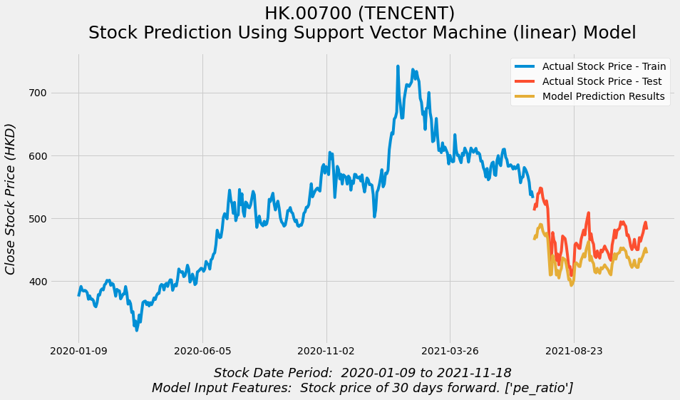
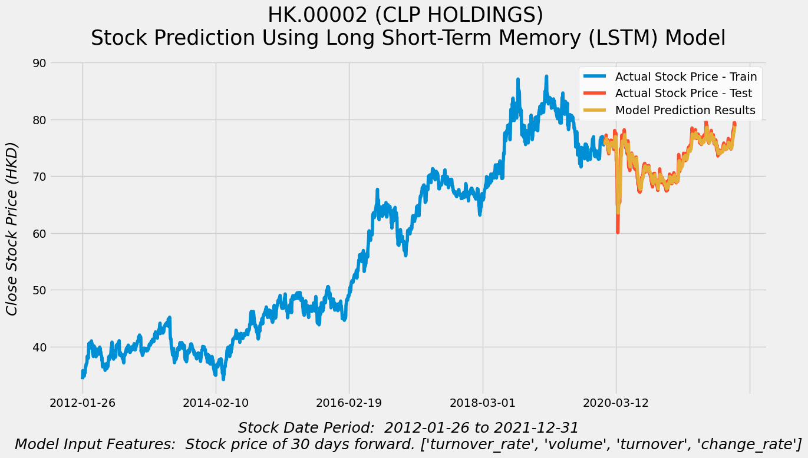
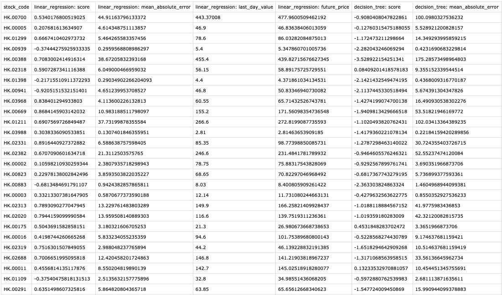
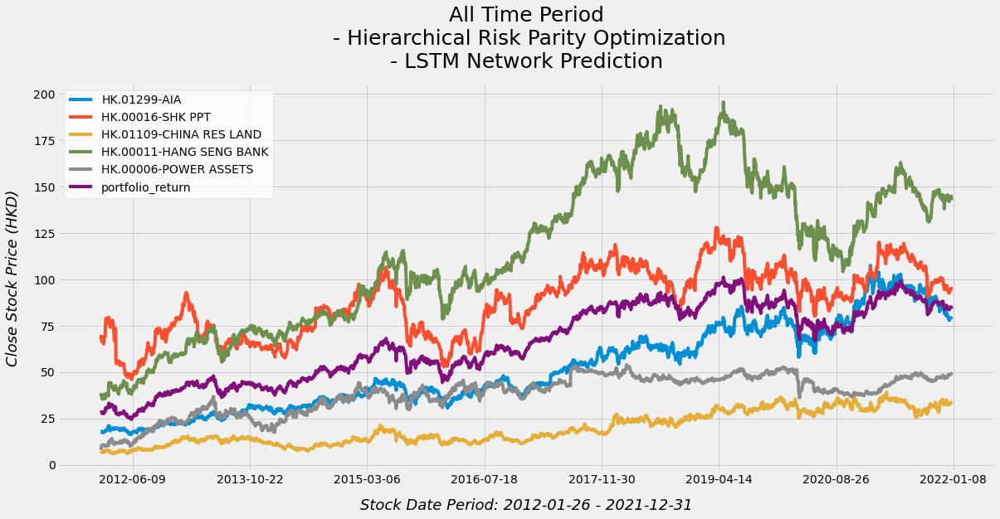
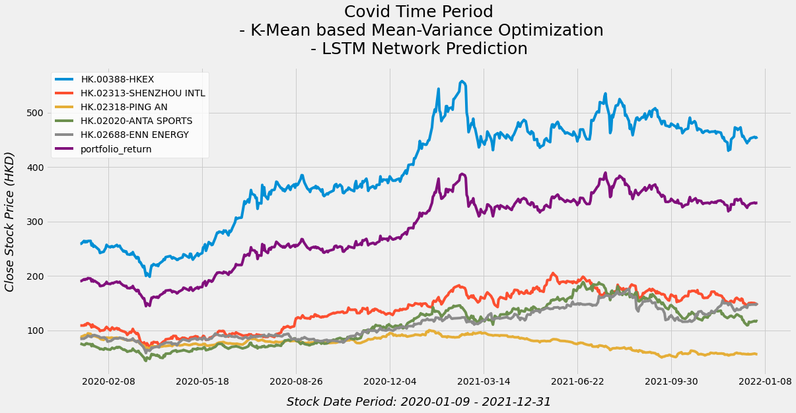
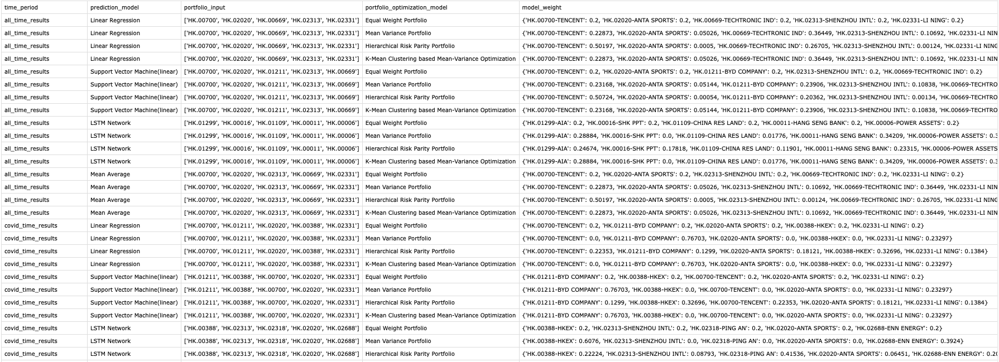

# Research-on-Stock-Prediction-based-Portfolio-Optimization

> An Empirical Study of Optimal Combination of Algorithms for Prediction-Based Portfolio Optimization Model using Machine Learning over Covid-19 Period using HK stock market

## What is this Project About?

- This is the final year project conducted myself during the study in Hong Kong Baptist University in 2022
- This project is the repository of a research which focuses on combining `Stock Prediction Algorithms` and `Portfolio Optimization Algorithms` together to maximize the portfolio performance. 
- This search uses the Hong Kong Stock Market and also studies the impact of Covid-19 on the stocks and portfolios performance.

## What does this Repository Include? 

- This Repository includes all the Data Source, Data Cleaning, Stock Prediction Algorithms, Portfolio Optimization Algorithms, Research Steps, Research Results that are needed in this research.

- [**DataSource**](./DataSource): This research collects historical stock data from Hong Kong Stock Market using FUTU OpenD API, including all 64 Hang Seng Index Stocks
- [**Research-Cookbook**](./Research-Cookbook): This is the actual practical research implementation step-by-step, from downloading source data, to data cleaning, build up all stock prediction algorithms, portfolio optimization algorithms, and finally conduct data analysis for studying results.
- [**Research-Program**](./Research-Program): As building up all stock prediction models and portfolio optimization models takes much computing power and memory, it may be hard to run these two process inside the jupyter notebook. The two .py programs inside Research-Program can be used to run through all model-building process and output results.
- [**Results**](./Results): All the results from overall research process are stored in this Results folder, where you can find all .csv .xlsx and figures result files.

## How to Set Up the Environment?

- You can first download this repository as a `.zip` file or run `git clone https://github.com/MaxMA2000/Research-on-Stock-Prediction-based-Portfolio-Optimization` in a folder where you want to set this repository.

- It is recommended to use `conda` or `virtual environment` to run the repository, for detailed installation on different operating system, please refer to:
  - [virtualenv Installation](https://virtualenv.pypa.io/en/latest/installation.html)
  - [conda Installation](https://docs.conda.io/projects/conda/en/latest/user-guide/install/index.html)
- If you use `virtualenv`, you can then activate the environment and `cd` to the local project repository, and then run `pip install -r requirements.txt` to install all dependcies
- If you use `conda`, please note that several packages used in this research can only be installed via `pip` currently, so it is recommended to directly run the notebook and install the dependcies via searching whether it is available on `conda` when the `No module named xxx package` error message shows up.

## How to Run Through the Research Process?

- After setting up the environment, you should be able to run through the research process step-by-step by following the notebooks inside [**Research-Cookbook**](./Research-Cookbook)
- **If you want to use re-run the research, please go directly to the step3 inside [Research-Cookbook](./Research-Cookbook), as step1&2 downloads and cleans up the data, the clean data source is already inside the [DataSource](./DataSource) folder**
- **If you want to add more stocks to your research, please go through the step1 to follow the instructions given inside to download extra stock data using[ FUTU OpenD API](https://openapi.futunn.com/futu-api-doc/en/quick/demo.html) or other Financial API, and step2 to perform data cleaning**
- As step3 and step5 requires large computing power and memory, the kernel may stop when you are using a Jupyter notebook, therefore, you can directly run the `.py` program inside [**Research-Program**](./Research-Program) to output the same results.

## Which Stock Prediction Algorithms and Portfolio Optimization Algorithms are Included in this Research?

| Stock Prediction Algorithms                               | Packages Used                                                | Remarks                                                      |
| --------------------------------------------------------- | ------------------------------------------------------------ | ------------------------------------------------------------ |
| Linear Regression Model                                   | [scikit-learn Linear Regression](https://scikit-learn.org/stable/modules/generated/sklearn.linear_model.LinearRegression.html) | LinearRegression fits a linear model with coefficients w = (w1, …, wp) to minimize the residual sum of squares between the observed targets in the dataset, and the targets predicted by the linear approximation. |
| Decession Tree Regressor                                  | [scikit-learn Decision Tree Regressor](https://scikit-learn.org/stable/modules/generated/sklearn.tree.DecisionTreeRegressor.html) | A decision tree regressor. The goal is to create a model that predicts the value of a target variable by learning simple decision rules inferred from the data features. A tree can be seen as a piecewise constant approximation. |
| Random Forest Regressor                                   | [scikit-learn Random Forest Regressor](https://scikit-learn.org/stable/modules/generated/sklearn.ensemble.RandomForestRegressor.html) | A random forest is a meta estimator that fits a number of classifying decision trees on various sub-samples of the dataset and uses averaging to improve the predictive accuracy and control over-fitting. |
| Support Vector Machine (kernel = 'linear', 'poly', 'ref') | [scikit-learn Support Vector Machine](https://scikit-learn.org/stable/modules/svm.html) | Support vector machines (SVMs) are a set of supervised learning methods used for classification, regression and outliers detection. This research uses three different kernel functions for building SVM: 'linear', 'poly', 'ref' |
| Long Short-Term Memory Network                            | [TensorFlow LSTM](https://www.tensorflow.org/api_docs/python/tf/keras/layers/LSTM) | Long short-term memory (LSTM) is an artificial recurrent neural network (RNN) architecture used in the field of deep learning. Previous researches have proven its outstanding performance in stock price prediction |

| Portfolio Optimization Algorithms                  | Packages Used                                                | Remarks                                                      |
| -------------------------------------------------- | ------------------------------------------------------------ | ------------------------------------------------------------ |
| Equal-Weighted Portfolio                           | Hard-Coded                                                   | Equally divide the weight of each stock in a given portfolio, used as benchmark for comparision |
| Mean-Variance Optimization                         | [PyPortfolioOpt Mean-Variance](https://pyportfolioopt.readthedocs.io/en/latest/MeanVariance.html) | Classic portfolio optimization approach, first developed in the Modern Portfolio Theory by Harry Max Markowitz |
| Hierarchical Risk Parity Optimization              | [PyPortfolioOpt Hierarchical Risk Parity](https://pyportfolioopt.readthedocs.io/en/latest/OtherOptimizers.html#hierarchical-risk-parity-hrp) | Hierarchical Risk Parity is a novel portfolio optimization method developed by Marcos Lopez de Prado, focuses on divide risk |
| K-Mean Clustering based Mean-Variance Optimization | [scikit-learn K-Means](https://scikit-learn.org/stable/modules/generated/sklearn.cluster.KMeans.html) [PyPortfolioOpt Mean-Variance](https://pyportfolioopt.readthedocs.io/en/latest/MeanVariance.html) | K-Means clustering is an unsupervised machine approach, this algorithm first divides the stocks into different clusters based on risk and return, then select the similar stocks to conduct Mean-Variance Optimization |

## What are the Research Results Look Like?

- The **Key Metrics** for defining the success of prediction and optimization algorithms are below:

| Types of Algorithms    | Key Metrics                                                  | Purpose                                                      |
| ---------------------- | ------------------------------------------------------------ | ------------------------------------------------------------ |
| Stock Prediction       | [R2 Score](https://scikit-learn.org/stable/modules/generated/sklearn.metrics.r2_score.html) [Mean Absolute Error](https://scikit-learn.org/stable/modules/generated/sklearn.metrics.mean_absolute_error.html) Last day price of certain stock Predicted future price of certain stock | Find out the models with highest prediction accuracy and select potential growing stocks to form portfolios |
| Portfolio Optimization | [Sharpe Ratio](https://www.investopedia.com/terms/s/sharperatio.asp) Cumulative Return (and price increase percentage) | Optimize the weight of each stock in a portfolio and find out their performance in balancing risk-and return, and earning ability |

- All the research results are stored in two formats:`figures` and `tables`, and you can find them in the [Results folder](./Results), some of the examples are also shown below:
  - `Figures`: [Stock Prediction Figures](./Results/PredictionResultFigures), [Portfolio Optimization Figures](./Results/PortfolioResultFigures)
  - `Tables (csv + xlsx)`: [Stock Prediction Tables](./Results/StockPrediction), [Portfolio Optimization Tables](./Results/PortfolioOptimization)

- Stock Prediction

- Portfolio Optimization

## Acknowledgement

This research as my final year project has received several helps and I would like to sincerely thank them for the effort:

- [**Ms. Queenie Lee**](https://fds.hkbu.edu.hk/eng/finance/staff/admin-details.jsp?id=queenieHKB&cv=00069&cid=219&cvurl=) for being my final year proejct supervisor and providing continuous help
- [**Robert Martin**](https://github.com/robertmartin8) for building [PyPortfolioOpt package](https://github.com/robertmartin8/PyPortfolioOpt) and helping me with installation problems via GitHub

